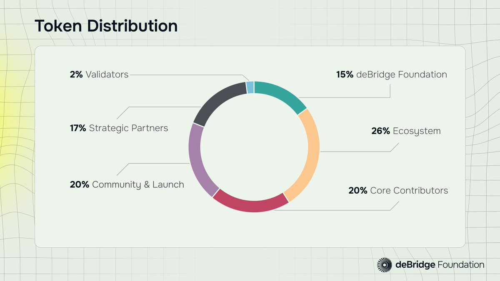

# 🪖 deBridge

[debridge.finance](https://debridge.finance/)    [Docs](https://docs.debridge.finance/)    [DApp](https://app.debridge.finance/)    [Twitter](https://x.com/deBridgeFinance)    [Discord](https://discord.com/invite/debridge)    [Claim](https://debridge.foundation/)

### 关键事件

* <mark style="background-color:blue;">2022-02-17：</mark>deBridge 在主网上线
* <mark style="background-color:blue;">2021-09-07：</mark>deBridge 完成 550 万美元种子轮融资

### 代币经济学

总供应量：<mark style="background-color:blue;">100亿</mark>&#x20;

初始流通量：<mark style="background-color:blue;">18亿</mark>

<figure><figcaption>
代币分布图
</figcaption></figure>

<figure><figcaption></figcaption></figure>


