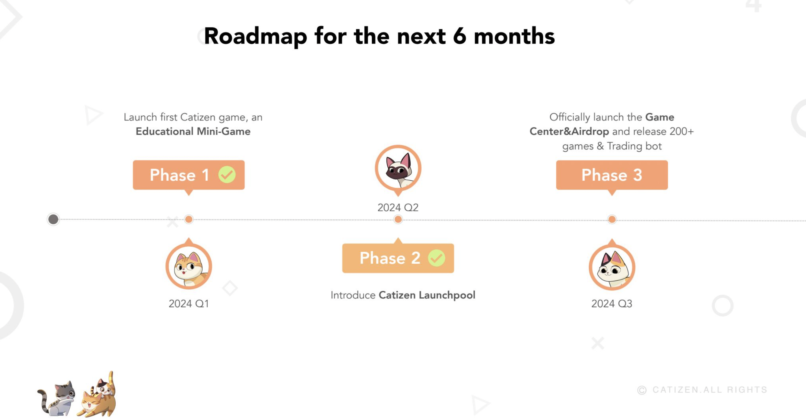
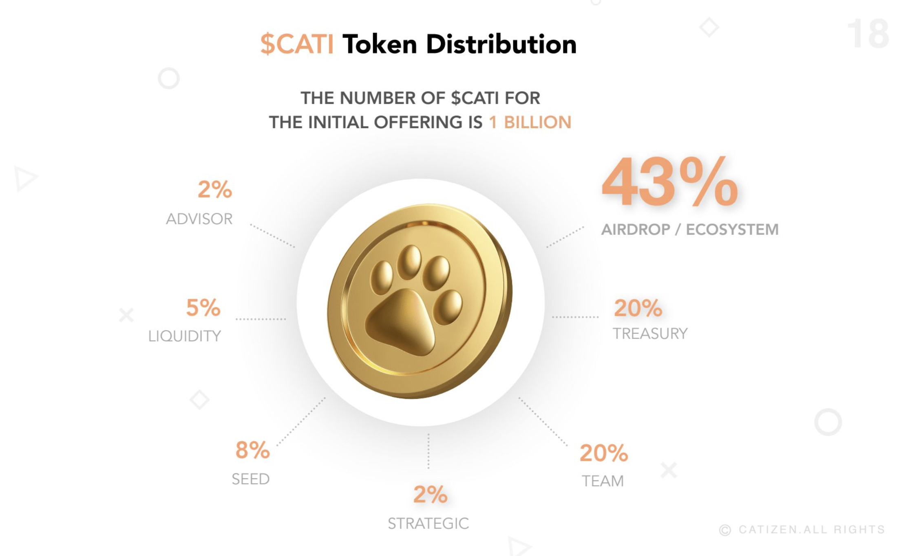

# 😻 Catizen

[catizen.ai](https://catizen.ai/)    [Twitter](https://x.com/CatizenAI)    [Telegram](https://t.me/CatizenAnn)

### 融资情况

* 2024-07-24：Catizen 完成战略融资，金额未披露（可能有币安）
* 2024-07-16：Catizen 完成 400 万美元战略融资
* 2023-06-19：Catizen 完成 220 万美元种子轮融资

### 路线图

<figure><figcaption></figcaption></figure>

### 代币经济模型

<figure><figcaption></figcaption></figure>
